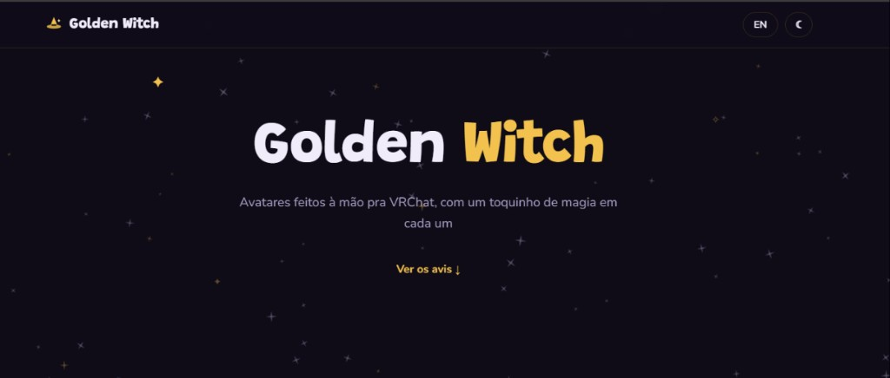
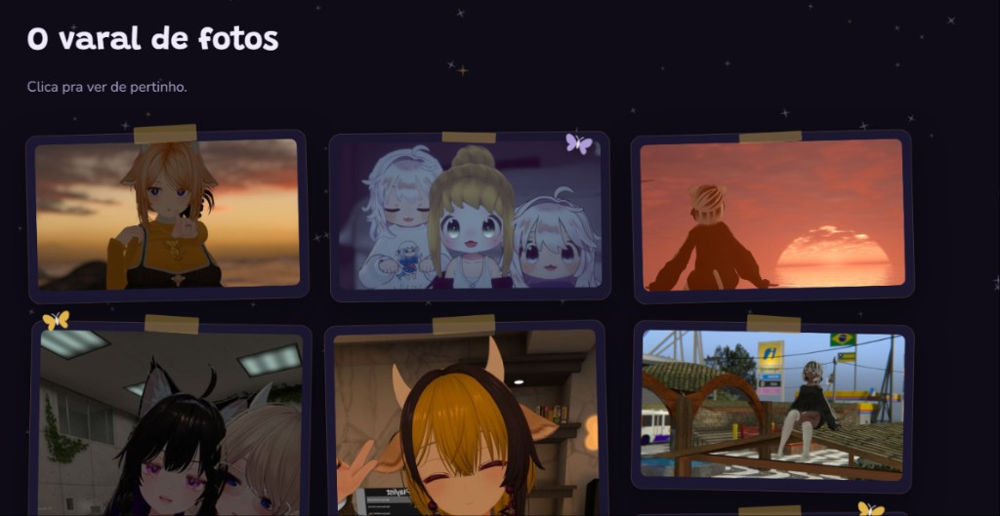
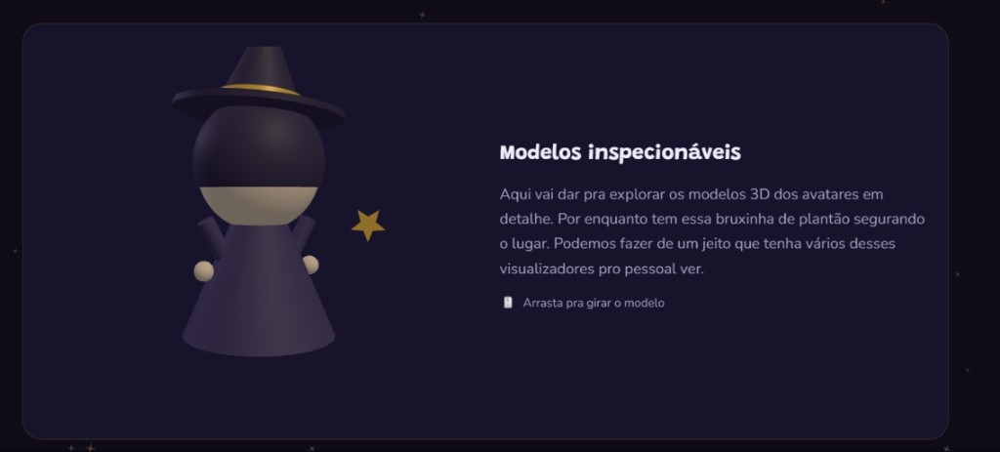

# ✨ Golden Witch

Site da **Golden Witch** — avatares feitos à mão pra VRChat, com um toquinho de magia em cada um.

Landing page com céu estrelado, galeria estilo varal de fotos, visualizador 3D e CTA pro Discord. Em português e inglês, com tema claro e escuro.

---

## Preview

### Hero
A primeira impressão: marca em destaque, tagline e o convite pra descer e ver os avis. Fundo de estrelinhas e sparkles dourados no clima de bruxaria fofa.



### Galeria — O varal de fotos
Polaroids grudadas com fita crepe, borboletinhas pousadas nas bordas. Clica numa foto e abre no lightbox pra ver de pertinho. Cada avi com sua vibe: praia no pôr do sol, crew de chibis, silhuetas no mar, close-ups e cenários temáticos.



### Modelos inspecionáveis
Um visualizador 3D com Three.js pra explorar os modelos de perto. Por enquanto a bruxinha de plantão segura o lugar — arrasta pra girar. No futuro, dá pra ter vários viewers, um pra cada avi.



---

## Stack

- **React** + **Vite**
- **Three.js** no viewer 3D
- CSS próprio (temas dark/light via `data-theme`)
- i18n simples (PT / EN)

## Rodar local

```bash
npm install
npm run dev
```

Build de produção:

```bash
npm run build
npm run preview
```

## Estrutura

```
src/
  components/   # Hero, Gallery, Models, CTA, Lightbox, Sky…
  hooks/        # scroll suave
  i18n.js       # textos PT/EN
public/img/     # fotos dos avis (+ thumbs)
```

## Discord

Encomendas, prévias e o papo da criação acontecem no Discord:  
[Entrar no servidor](https://discord.com/invite/4K2qCg628X)
